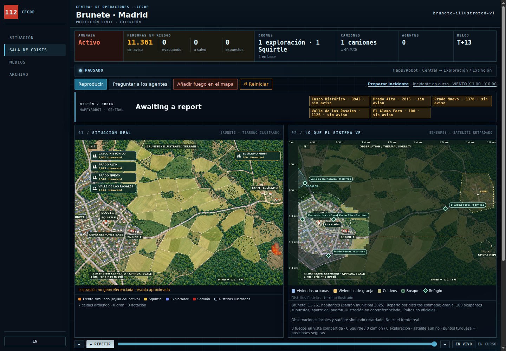
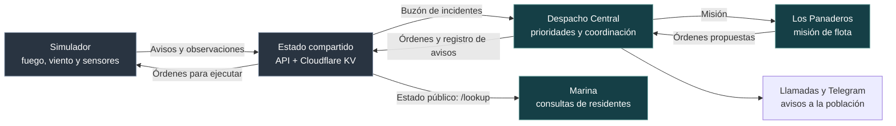

<div align="center">
  
  <h1>Los Panaderos</h1>
  <p><strong>Del primer aviso de humo a una respuesta coordinada.</strong></p>
  <p>Agentes de IA, drones y comunicaciones para simular una emergencia forestal en Brunete.</p>
  <p><strong>HackSpain 2026 · Equipo 9 · HappyRobot</strong></p>
</div>

<p align="center">
  <a href="#cómo-funciona">Cómo funciona</a> ·
  <a href="#explorar-la-demo">Probar la demo</a> ·
  <a href="#adaptación-y-aprendizaje">Adaptación y aprendizaje</a> ·
  <a href="#documentación">Documentación</a>
</p>



*Sala de crisis en `main`: incidente simulado, pausado en T+13. Captura local sin
conexión a HappyRobot ni órdenes de agentes.*

## Los primeros minutos importan

El humo llega antes que la confirmación. El viento cambia. Hay más frentes que
medios, y enviar un camión a un sector deja otro esperando.

**Los Panaderos conecta información, decisiones y acciones:** una centralita
multiagente recibe avisos y observaciones, prioriza distritos, coordina la flota
y comunica qué debe hacer la población. El operador sigue el incidente desde
CECOP, la central de operaciones.

| Observar | Decidir | Actuar |
|:---|:---|:---|
| Aviso de humo, sensores locales y satélite retardado. | Verificar el foco, priorizar personas y asignar recursos. | Explorar, contener, movilizar camiones y emitir avisos. |

**La información es incompleta por diseño.** El mapa de la izquierda muestra el
incendio simulado; el de la derecha, lo que el sistema conoce. Un foco nuevo
permanece oculto para los agentes hasta que sus sensores lo descubren.

## Cómo funciona



**HappyRobot decide la estrategia; el simulador ejecuta el movimiento.**
Los vehículos resuelven rutas, distancias de seguridad y extinción localmente.
Las órdenes se validan antes de aplicarse: coordenadas fuera del mapa,
distritos inexistentes o razones vacías producen un rechazo visible.

| Quién | Responsabilidad |
|:---|:---|
| **Despacho Central** | Decide qué verificar, a quién avisar y qué misión encargar a la flota. |
| **Los Panaderos** | Coordina las órdenes de exploración, contención y camiones, con una orden por vehículo. |
| **Llamadas y Telegram** | Comunican instrucciones a contactos y distritos; informar y evacuar son acciones distintas. |
| **Marina** | Atiende consultas de residentes: pregunta nombre y barrio y consulta el estado público. |

### Un ejemplo

1. **Llega un aviso de humo** cerca de la granja, todavía sin confirmación local.
2. **Despacho decide qué hacer primero:** verificar, avisar preventivamente o
   movilizar recursos según la información disponible.
3. **La flota ejecuta:** el scout explora o avisa, el dron de extinción contiene
   desde posiciones seguras y el camión ataca el sector asignado.
4. **Aparece información nueva:** cambia el viento o el scout descubre otro foco.
   El simulador envía un nuevo evento para que Despacho reconsidere la respuesta.

## Qué encontrarás en CECOP

| Pantalla | Para qué sirve |
|:---|:---|
| **Situación** | Vista general del incidente y acceso a la sala de crisis. |
| **Sala de crisis** | Dos mapas, misión, población, órdenes, viento y controles de simulación. |
| **Medios** | Disponibilidad y estado de los recursos. |
| **Archivo** | Consulta del estado compartido, eventos y comunicaciones del incidente. |

La interfaz está disponible en **español e inglés**. Puedes configurar la flota,
pausar el reloj, cambiar el viento y añadir focos para observar cómo evoluciona
la información disponible.

## Explorar la demo

**Necesitas Python 3.** El servidor local usa la biblioteca estándar, sin
dependencias Python externas ni compilación del frontend.

```sh
git clone https://github.com/jucamohedano/Los_Panaderos.git
cd Los_Panaderos
python3 -m simulator.server
```

Abre **<http://127.0.0.1:8765>** y entra en **Sala de crisis**.
Configura flota y viento, pulsa **1 · Ignición** y después **2 · Aviso de humo**.

En un checkout limpio puedes explorar la interfaz y el fuego simulado sin
credenciales. **Las decisiones de agentes requieren conectar HappyRobot**;
el servidor local no las inventa.

<details>
<summary><strong>Conectar HappyRobot y las comunicaciones</strong></summary>

1. Copia [`.env.example`](.env.example) a `.env`.
2. Configura `STATE_API_URL` y `STATE_API_TOKEN` para el Worker y su KV
   ([código de la API](state-api/)). Configura la misma conexión en los
   workflows de HappyRobot.
3. Mantén `HAPPYROBOT_MODE=loop` y usa el mismo `DISPATCH_INCIDENT_ID`
   en simulador y Despacho; el valor por defecto es `brunete-demo`.
4. Configura los contactos `DEMO_*` con teléfonos y Telegram del equipo:
   **los canales conectados envían llamadas y mensajes reales**.
5. Reinicia el servidor y abre un run de **Despacho Central** en
   **development** antes de iniciar el incidente y enviar el aviso de humo.

En modo `loop`, el simulador escribe en el buzón compartido y recoge las
órdenes que deja Despacho. El simulador no inicia runs de HappyRobot.

**Reiniciar también solicita borrar el estado compartido** cuando la API está
conectada. Comprueba el estado de conexión si el borrado falla.

El modo alternativo `HAPPYROBOT_MODE=push` inicia un run por decisión y requiere
un proxy MCP local autenticado; sus variables están en `.env.example`.

[Despacho Central](https://platform.eu.happyrobot.ai/hackspainteam9/workflows/zqtnabjy5loj/editor/wm9viy0rm87v)
· [Los Panaderos](https://platform.eu.happyrobot.ai/hackspainteam9/workflows/mg9barxt86w3/editor/ol9kqyjzgq0m)
· [Marina](https://platform.eu.happyrobot.ai/hackspainteam9/workflows/8angdc9uc7nz/editor/m3cs7r55sfuv)

</details>

## Adaptación y aprendizaje

**En `main`:** los cambios de viento y las nuevas observaciones generan eventos
para revisar la respuesta durante el incidente.

**En la ampliación de [PR #1](https://github.com/jucamohedano/Los_Panaderos/pull/1):**
pronósticos de futuros posibles, detección de divergencias y memoria de
experiencias en SQLite. Esta ampliación todavía no forma parte de `main`.

```text
Antes de decidir       Durante el incidente       Después de decidir
─────────────────      ──────────────────────      ───────────────────
Recuperar casos        Ejecutar órdenes            Comparar alternativas
y lecciones            y observar                  con el evaluador
        ↓                       ↓                          ↓
Preparar un brief      Comparar observaciones      Post-mortem explica
y simular futuros      con el pronóstico           y propone lecciones
        ↓                       ↓                          ↓
HappyRobot decide      Pedir una nueva decisión    Guardar en SQLite
                       si cambia la situación      para futuras decisiones
```

- **Obtener experiencia:** workflow opcional que selecciona la evidencia útil
  del brief; sigue sin publicar y cuenta con un resumen determinista de respaldo.
- **Post-mortem:** analiza decisiones pasadas; complementa el razonamiento previo
  de Despacho con evaluación retrospectiva.
- **Jev:** integración opcional en sombra para comparar recomendaciones; nunca
  aplica órdenes.

Aprender aquí significa **recuperar experiencia relevante como contexto**,
sin reentrenar el modelo. La mejora de las decisiones de HappyRobot con esa
memoria aún debe demostrarse en una evaluación en vivo.

## Documentación

| Quiero entender… | Referencia |
|:---|:---|
| Los agentes y sus herramientas | [Workflow Los Panaderos](docs/los-panaderos-workflow.md) |
| La integración actual con HappyRobot | [Cambios de workflows](docs/happyrobot-workflow-changes.md) |
| Qué se ha probado con agentes reales | [Validación de escenarios](docs/demo-validation.md) |
| La procedencia de población, mapa y refugios | [Datos del escenario](docs/population-provenance.md) |
| El bucle de aprendizaje de la ampliación | [Diseño y diagramas en PR #1](https://github.com/jucamohedano/Los_Panaderos/blob/devin/1789865844-possible-worlds/docs/self-healing-loop.md) |
| Los resultados y límites de esa evaluación | [Evaluación de adaptación en PR #1](https://github.com/jucamohedano/Los_Panaderos/blob/devin/1789865844-possible-worlds/docs/adaptation-evaluation.md) |

<details>
<summary><strong>Comprobaciones locales para desarrollo</strong></summary>

Python para el simulador; Node.js para los tests del dashboard y de la API.

```sh
python3 -m unittest discover -s tests -p 'test_*.py'
node --test tests/*.cjs
node --test state-api/src/*.test.js
```

</details>

---

**Alcance de la demo.** El fuego, sensores y movimientos son simulados; el mapa
es ilustrado y no está georreferenciado. Los **11.261 habitantes** corresponden
al total censal de Brunete de 2025; su reparto entre distritos y las **100 personas
de la granja** son supuestos del escenario. Los puntos de encuentro no son un
plan oficial de evacuación. Es un prototipo educativo, no una predicción
operativa de incendios.
