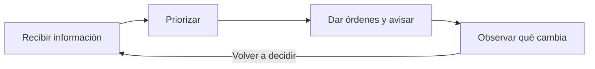

<div align="center">
  
  <h1>Los Panaderos</h1>
  <p><strong>Sistema multiagente para coordinación de incendios</strong></p>
  <p>Del primer aviso de humo a una respuesta coordinada.</p>
</div>

<p align="center">
  <a href="#cómo-funciona">Cómo funciona</a> ·
  <a href="#explorar-la-demo">Probar la demo</a> ·
  <a href="#próximos-pasos">Próximos pasos</a> ·
  <a href="#documentación">Documentación</a>
</p>


*Sala de crisis: incidente simulado, pausado en T+13. Captura local sin
conexión a HappyRobot ni órdenes de agentes.*

<!--
  Short demo video: simulation (maps, fleet, wind) + HappyRobot in action
  (Despacho, drones, Telegram / llamada). Drop the file and uncomment:

  <video src="docs/demo.mp4" controls width="100%"></video>
-->

## Los primeros minutos importan

El humo llega antes que la confirmación. El viento cambia. Hay más frentes que
medios. Mandar el camión a un sector es dejar el otro esperando.

El cuello de botella no es solo el fuego. Es la centralita: filtrar avisos,
priorizar a la población y coordinar a la vez la flota y las comunicaciones.
Un protocolo fijo se queda atrás en el primer cambio de frente.

| Observar | Decidir | Actuar |
|:---|:---|:---|
| Aviso de humo, sensores locales y satélite retardado. | Verificar el foco, priorizar personas y asignar recursos. | Explorar, contener, movilizar camiones y emitir avisos. |

**La información es incompleta por diseño.** El mapa de la izquierda muestra el
incendio simulado; el de la derecha, lo que el sistema conoce. Un foco nuevo
permanece oculto para los agentes hasta que sus sensores lo descubren.

## Cómo funciona

Usamos HappyRobot junto a un motor de simulación.

HappyRobot es el cerebro. Agentes que razonan, avisan y asignan misiones.
El simulador es el mundo: incendio, viento, sensores, vehículos y población.
HappyRobot no sustituye la física. El motor avanza el fuego, mueve la flota
y comprueba cada orden.



El simulador escribe en el buzón. HappyRobot lee y decide. El motor aplica la
orden o la rechaza a la vista. El reloj se para mientras los agentes deliberan.

Cada vehículo tiene autonomía táctica en el simulador: planificador de ruta,
distancia de seguridad al fuego y sistema de extinción. HappyRobot no pilota
cada celda.

| Quién | Responsabilidad |
|:---|:---|
| **Despacho Central** | Decide qué verificar, a quién avisar y qué misión encargar a la flota. |
| **Los Panaderos** | Coordina las órdenes de exploración, contención y camiones, con una orden por vehículo. |
| **Llamadas y Telegram** | Comunican instrucciones a contactos y distritos; informar y evacuar son acciones distintas. |
| **Marina** | Atiende consultas de residentes: pregunta nombre y barrio y consulta el estado público. |

| Medio | Papel |
|:---|:---|
| Dron scout | Patrulla, confirmación temprana, megafonía de aviso |
| Dron extinguisher | Reconocimiento cercano y contención. No vuela a una celda en llamas |
| Camión de bomberos | Ataque al sector (`attack_sector`). Medio principal de extinción |

Un camión en el sector A no está en el B. Drones autónomos patrullan para
detectar pronto. Reducen la incertidumbre y solo entonces se desvía la
extinción o se alerta a un distrito.

### Un ejemplo

1. **Llega un aviso de humo**, todavía sin confirmación local.
2. **Despacho decide qué hacer primero:** verificar, avisar preventivamente o
   movilizar recursos según la información disponible.
3. **La flota ejecuta:** el scout explora o avisa, el dron de extinción contiene
   desde posiciones seguras y el camión ataca el sector asignado.
4. **Aparece información nueva:** cambia el viento o el scout descubre otro foco.
   El simulador envía un nuevo evento para que Despacho reconsidere la respuesta.

No se evacúa el municipio entero. Se avisa el distrito amenazado, o se informa
sin mover a la población. Un mensaje de calma no debe salir como evacuación.

La llamada del vecino no pasa por el buzón. Marina pregunta nombre y barrio
y lee el estado público (`GET /lookup`).

## Qué encontrarás en CECOP

| Pantalla | Para qué sirve |
|:---|:---|
| **Situación** | Vista general del incidente y acceso a la sala de crisis. |
| **Sala de crisis** | Dos mapas, misión, población, órdenes, viento y controles de simulación. |
| **Medios** | Disponibilidad y estado de los recursos. |
| **Archivo** | Consulta del estado compartido, eventos y comunicaciones del incidente. |

La interfaz está disponible en **español e inglés**. Puedes configurar la flota,
pausar el reloj, cambiar el viento y añadir focos para observar cómo evoluciona
la información disponible. El operador ve la sala CECOP.

Más adelante: cruce con bases gubernamentales de residentes en zona, y cámaras
térmicas en los drones. Hoy el aviso usa el directorio de demo y sensores
simulados.

## Explorar la demo

**Necesitas Python 3.** El servidor local usa la biblioteca estándar, sin
dependencias Python externas ni compilación del frontend.

```sh
git clone https://github.com/Fedeloz/Los_Panaderos.git
cd Los_Panaderos
python3 -m simulator.server
```

Abre **<http://127.0.0.1:8765>** y entra en **Sala de crisis**.
Configura flota y viento, pulsa **1 · Ignición** y después **2 · Aviso de humo**.

En un checkout limpio puedes explorar la interfaz y el fuego simulado sin
credenciales. **Las decisiones de agentes requieren conectar HappyRobot**;
el servidor local no las inventa.

<details>
<summary><strong>Conectar HappyRobot y las comunicaciones</strong></summary>

1. Copia [`.env.example`](.env.example) a `.env`.
2. Configura `STATE_API_URL` y `STATE_API_TOKEN` para el Worker y su KV
   ([código de la API](state-api/)). Configura la misma conexión en los
   workflows de HappyRobot.
3. Mantén `HAPPYROBOT_MODE=loop` y usa el mismo `DISPATCH_INCIDENT_ID`
   en simulador y Despacho; el valor por defecto es `brunete-demo`.
4. Configura los contactos `DEMO_*` con teléfonos y Telegram del equipo:
   **los canales conectados envían llamadas y mensajes reales**.
5. Reinicia el servidor y abre un run de **Despacho Central** en
   **development** antes de iniciar el incidente y enviar el aviso de humo.

En modo `loop`, el simulador escribe en el buzón compartido y recoge las
órdenes que deja Despacho. El simulador no inicia runs de HappyRobot.

**Reiniciar también solicita borrar el estado compartido** cuando la API está
conectada. Comprueba el estado de conexión si el borrado falla.

El modo alternativo `HAPPYROBOT_MODE=push` inicia un run por decisión y requiere
un proxy MCP local autenticado; sus variables están en `.env.example`.

[Despacho Central](https://platform.eu.happyrobot.ai/hackspainteam9/workflows/zqtnabjy5loj/editor/wm9viy0rm87v)
· [Los Panaderos](https://platform.eu.happyrobot.ai/hackspainteam9/workflows/mg9barxt86w3/editor/ol9kqyjzgq0m)
· [Marina](https://platform.eu.happyrobot.ai/hackspainteam9/workflows/8angdc9uc7nz/editor/m3cs7r55sfuv)

</details>

## Documentación

| Quiero entender… | Referencia |
|:---|:---|
| Los agentes y sus herramientas | [Workflow Los Panaderos](docs/los-panaderos-workflow.md) |
| La integración actual con HappyRobot | [Cambios de workflows](docs/happyrobot-workflow-changes.md) |
| Qué se ha probado con agentes reales | [Validación de escenarios](docs/demo-validation.md) |
| La procedencia de población, mapa y refugios | [Datos del escenario](docs/population-provenance.md) |

<details>
<summary><strong>Comprobaciones locales para desarrollo</strong></summary>

Python para el simulador; Node.js para los tests del dashboard y de la API.

```sh
python3 -m unittest discover -s tests -p 'test_*.py'
node --test tests/*.cjs
node --test state-api/src/*.test.js
```

</details>

## Próximos pasos

Estas capacidades **todavía no están en `main`**:

| Paso | Objetivo |
|:---|:---|
| **Anticipar** | Integrar pronósticos de futuros posibles y pedir una nueva decisión cuando las observaciones contradigan el pronóstico. |
| **Recordar** | Recuperar casos y lecciones de SQLite para preparar un breve contexto antes de decidir. |
| **Revisar** | Conectar la evaluación de alternativas y Post-mortem para explicar resultados y guardar lecciones después de actuar. |
| **Seleccionar experiencia** | Integrar el workflow opcional **Obtener experiencia**, aún sin publicar, con un resumen determinista de respaldo. |
| **Comparar recomendaciones** | Incorporar **Jev** como observador opcional en sombra, sin capacidad para aplicar órdenes. |
| **Validar la mejora** | Evaluar con HappyRobot en vivo si la experiencia recuperada mejora las decisiones. |

El objetivo es aprender mediante **experiencia relevante en el contexto**,
sin reentrenar el modelo.

---

**Alcance de la demo.** El escenario actual es Brunete. El fuego, sensores y
movimientos son simulados; el mapa es ilustrado y no está georreferenciado.
Los **11.261 habitantes** corresponden al total censal de Brunete de 2025;
su reparto entre distritos y las **100 personas de la granja** son supuestos
del escenario. Los puntos de encuentro no son un plan oficial de evacuación.
Es un prototipo educativo, no una predicción operativa de incendios.
