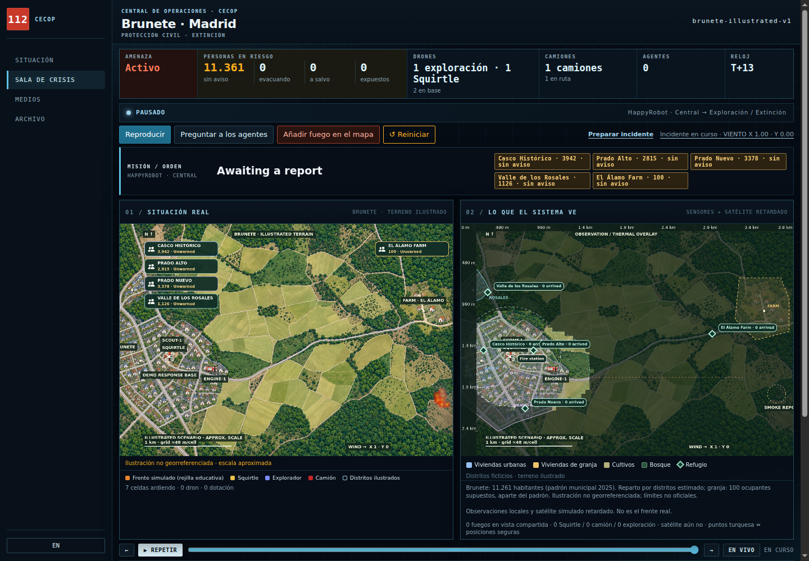
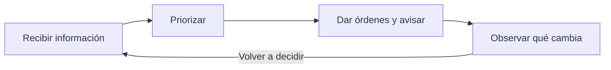

<div align="center">
  
  <h1>Los Panaderos</h1>
  <p><strong>Sistema multiagente para coordinación de incendios</strong></p>
  <p>Del primer aviso de humo a una respuesta coordinada.</p>
</div>

<p align="center">
  <a href="#cómo-funciona">Cómo funciona</a> ·
  <a href="#explorar-la-demo">Probar la demo</a> ·
  <a href="#próximos-pasos">Próximos pasos</a> ·
  <a href="#documentación">Documentación</a>
</p>



*Sala de crisis: incidente simulado, pausado en T+13. Captura local.*

<!--
  Short demo video: simulation (maps, fleet, wind) + the policy deciding and
  the fleet acting. Drop the file and uncomment:

  <video src="docs/demo.mp4" controls width="100%"></video>
-->

## Los primeros minutos importan

El humo llega antes que la confirmación. El viento cambia. Hay más frentes que
medios. Mandar el camión a un sector es dejar el otro esperando.

El cuello de botella no es solo el fuego. Es la centralita: filtrar avisos,
priorizar a la población y coordinar a la vez la flota y las comunicaciones.
Un protocolo fijo se queda atrás en el primer cambio de frente.

| Observar | Decidir | Actuar |
|:---|:---|:---|
| Aviso de humo, sensores locales y satélite retardado. | Verificar el foco, priorizar personas y asignar recursos. | Explorar, contener, movilizar camiones y emitir avisos. |

**La información es incompleta por diseño.** El mapa de la izquierda muestra el
incendio simulado; el de la derecha, lo que el sistema conoce. Un foco nuevo
permanece oculto para los agentes hasta que sus sensores lo descubren.

## Cómo funciona

El motor de simulación es el mundo: incendio, viento, sensores, vehículos y
población. Avanza el fuego, mueve la flota y comprueba cada orden.

Una política de decisión decide a quién avisar y qué enviar a cada vehículo.
No sustituye la física: elige objetivos y el motor los valida.


```mermaid
flowchart LR
    INFO["Recibir información"] --> PRIORIDAD["Priorizar"]
    PRIORIDAD --> ACTUAR["Dar órdenes y avisar"]
    ACTUAR --> OBSERVAR["Observar qué cambia"]
    OBSERVAR -->|"Volver a decidir"| INFO
```

El simulador lee, la política decide y el motor aplica la orden o la rechaza
a la vista.

Cada vehículo tiene autonomía táctica en el simulador: planificador de ruta,
distancia de seguridad al fuego y sistema de extinción. La decisión no pilota
cada celda.

| Pieza | Responsabilidad |
|:---|:---|
| **Política de decisión** (`simulator/policy.py`) | Decide qué verificar, a quién avisar y qué misión encargar a la flota. |
| **Coordinación de flota** | Una orden por vehículo: exploración, contención y camiones. |
| **Comunicaciones** | Instrucciones a contactos y distritos; informar y evacuar son acciones distintas. |
| **Consulta pública** | Un residente pregunta nombre y barrio y lee el estado compartido. |

| Medio | Papel |
|:---|:---|
| Dron scout | Patrulla, confirmación temprana, megafonía de aviso |
| Dron extinguisher | Reconocimiento cercano y contención. No vuela a una celda en llamas |
| Camión de bomberos | Ataque al sector (`attack_sector`). Medio principal de extinción |

Un camión en el sector A no está en el B. Drones autónomos patrullan para
detectar pronto. Reducen la incertidumbre y solo entonces se desvía la
extinción o se alerta a un distrito.

### Un ejemplo

1. **Llega un aviso de humo**, todavía sin confirmación local.
2. **La política decide qué hacer primero:** verificar, avisar preventivamente o
   movilizar recursos según la información disponible.
3. **La flota ejecuta:** el scout explora o avisa, el dron de extinción contiene
   desde posiciones seguras y el camión ataca el sector asignado.
4. **Aparece información nueva:** cambia el viento o el scout descubre otro foco.
   El simulador envía un nuevo evento para que la política reconsidere la respuesta.

No se evacúa el municipio entero. Se avisa el distrito amenazado, o se informa
sin mover a la población. Un mensaje de calma no debe salir como evacuación.

La llamada del vecino no pasa por el buzón de incidentes. Se consulta el
estado público del distrito.

## Qué encontrarás en CECOP

| Pantalla | Para qué sirve |
|:---|:---|
| **Situación** | Vista general del incidente y acceso a la sala de crisis. |
| **Sala de crisis** | Dos mapas, misión, población, órdenes, viento y controles de simulación. |
| **Medios** | Disponibilidad y estado de los recursos. |
| **Archivo** | Consulta del estado compartido, eventos y comunicaciones del incidente. |

La interfaz está disponible en **español e inglés**. Puedes configurar la flota,
pausar el reloj, cambiar el viento y añadir focos para observar cómo evoluciona
la información disponible. El operador ve la sala CECOP.

Más adelante: cruce con bases gubernamentales de residentes en zona, y cámaras
térmicas en los drones. Hoy el aviso usa el directorio de demo y sensores
simulados.

## Explorar la demo

**Necesitas Python 3.** El servidor local usa la biblioteca estándar, sin
dependencias Python externas ni compilación del frontend.

```sh
git clone https://github.com/Fedeloz/Los_Panaderos.git
cd Los_Panaderos
python3 -m simulator.server
```

Abre **<http://127.0.0.1:8765>** y entra en **Sala de crisis**.
Configura flota y viento, pulsa **1 · Ignición** y después **2 · Aviso de humo**.

En un checkout limpio la demo funciona sin credenciales, sin cuentas y sin
servicios externos. La decisión la toma `simulator/policy.py`, una política
determinista que se ejecuta dentro del propio simulador.

<details>
<summary><strong>Cómo se decide ahora</strong></summary>

El proyecto se desarrolló con HappyRobot como cerebro: los workflows
*Despacho Central*, *Los Panaderos* y *Marina* razonaban, avisaban y
asignaban misiones, y el simulador validaba cada orden. Esa integración se
retiró en `bec869f`. Hoy la decisión es determinista y local:

- `simulator/policy.py` devuelve exactamente la misma estructura de decisión
  que `Simulation.apply()` ya validaba: una orden por vehículo, más `mission`
  y `reason`.
- La política solo lee el estado limitado por observaciones, nunca la verdad
  oculta del incendio. El motor sigue rechazando órdenes obsoletas,
  inseguras, incompletas o duplicadas.
- `SimulatorSession` es la única costura: llama a `policy.decide(sim)` y luego
  a `sim.apply(...)`. Sustituir la política no toca el motor ni el servidor.

El motor de simulación, los agentes de comunicación y la experiencia
recuperada siguen siendo los mismos. Los workflows de HappyRobot ya no son
necesarios para la demo.

</details>

## Documentación

| Quiero entender… | Referencia |
|:---|:---|
| Los agentes y sus herramientas | [Workflow Los Panaderos](docs/los-panaderos-workflow.md) |
| La integración actual con HappyRobot | [Cambios de workflows](docs/happyrobot-workflow-changes.md) |
| Qué se ha probado con agentes reales | [Validación de escenarios](docs/demo-validation.md) |
| La procedencia de población, mapa y refugios | [Datos del escenario](docs/population-provenance.md) |

<details>
<summary><strong>Comprobaciones locales para desarrollo</strong></summary>

Python para el simulador; Node.js para los tests del dashboard y de la API.

```sh
python3 -m unittest discover -s tests -p 'test_*.py'
node --test tests/*.cjs
node --test state-api/src/*.test.js
```

</details>

## Próximos pasos

Estas capacidades **todavía no están en `main`**:

| Paso | Objetivo |
|:---|:---|
| **Anticipar** | Integrar pronósticos de futuros posibles y pedir una nueva decisión cuando las observaciones contradigan el pronóstico. |
| **Recordar** | Recuperar casos y lecciones de SQLite para preparar un breve contexto antes de decidir. |
| **Revisar** | Conectar la evaluación de alternativas y Post-mortem para explicar resultados y guardar lecciones después de actuar. |
| **Seleccionar experiencia** | Integrar el workflow opcional **Obtener experiencia**, aún sin publicar, con un resumen determinista de respaldo. |
| **Comparar recomendaciones** | Incorporar **Jev** como observador opcional en sombra, sin capacidad para aplicar órdenes. |
| **Validar la mejora** | Evaluar con HappyRobot en vivo si la experiencia recuperada mejora las decisiones. |

El objetivo es aprender mediante **experiencia relevante en el contexto**,
sin reentrenar el modelo.

---

**Alcance de la demo.** El escenario actual es Brunete. El fuego, sensores y
movimientos son simulados; el mapa es ilustrado y no está georreferenciado.
Los **11.261 habitantes** corresponden al total censal de Brunete de 2025;
su reparto entre distritos y las **100 personas de la granja** son supuestos
del escenario. Los puntos de encuentro no son un plan oficial de evacuación.
Es un prototipo educativo, no una predicción operativa de incendios.
